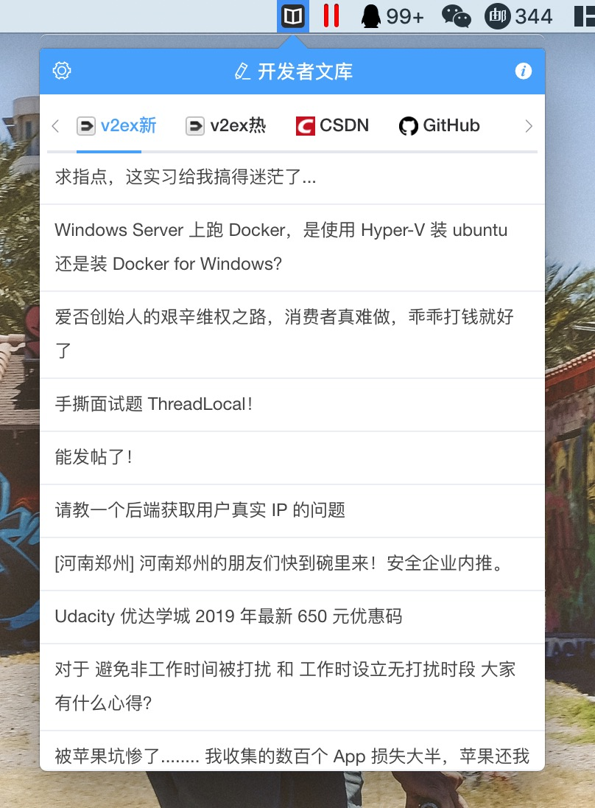
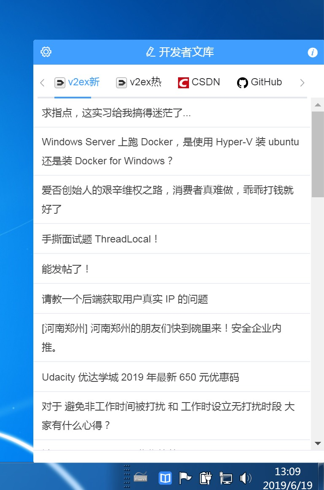

# A cross-platform open-source app that aggregates web articles for local offline reading.

> 一款网络文章本地离线进行聚合的跨平台开源APP

## 下载地址

https://github.com/cteams/Wenku/releases

## 使用效果

**MAC**

**WIN**

**Developer Library**
Web

A cross-platform, open-source app that aggregates web articles for local offline reading.

**Supported Sites**
| Name                    | Address                                       |
|-------------------------|-----------------------------------------------|
| v2ex - Latest           | https://www.v2ex.com                          |
| v2ex - Hottest          | -                                             |
| Developer Headlines - Today's Content | https://toutiao.io                  |
| Segmentfault - Daily Hotspots       | https://segmentfault.com/hottest       |
| Bobo Online - Latest Content         | http://blog.jobbole.com                 |
| CSDN - Latest Recommendations        | https://blog.csdn.net                    |
| GitHub - Today's Hottest             | https://github.com/explore?since=weekly#trending |
| Gitbook - Latest Content             | https://gitbook.cn                       |
| Freebuf - Latest Content             | https://www.freebuf.com                  |
| 51CTO - Latest Content               | https://blog.51cto.com                   |
| InfoQ - 7-Day Hottest                | https://www.infoq.cn/hotlist?tag=day     |
| Imooc Notes - Recommended Content    | https://www.imooc.com/article            |
| Open Source China - Latest Content   | https://www.oschina.net                  |
| Open Source China - Professional Q&A | https://www.oschina.net/question?catalog=100 |
| Open Source China - Open Source Interviews | https://www.oschina.net/question/topic/osc-intervie |

**About**
Produced by: C.TEAM
E-mail: service@c.team

--- 

This translation maintains the structure and the information contained in the original page, reflecting both the utility and scope of the application as well as providing essential links and contact information.

## 关于

- 出品：C.TEAM
- E-mail：service@c.team
